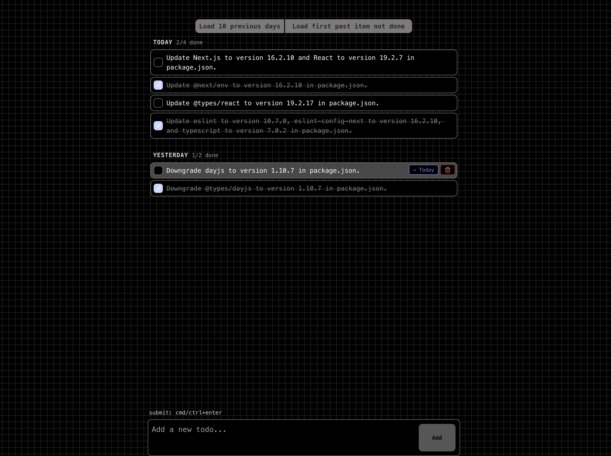

# Todos

_Todos_ is a minimalist todo app built with Next.js and TypeScript.

[Changelog](./CHANGELOG.md)

<p align="center">
  
</p>

**Notice: As I am working simultaneously on a lot of projects, things here may seem to move slowly but they are still in progress. I'm always monitoring my notifications and messages, so if you have any questions or want to chat about anything, feel free [to reach out](https://www.jeantinland.com/contact/)!**

## Storage Architecture

_Todos_ uses a **file-based storage system**:

- **Todos** are stored as `.json` files in the `contents/` folder
- **Preferences** are stored in the browser's localStorage (client-side)

This approach makes your data:

- Easy to backup (just copy the `contents/` folder)
- Version control friendly
- Human-readable and editable
- Portable across systems

## Dependencies & requirements

- npm
- node >= 18.18
- pm2

## Installation

Once you installed npm, node and pm2, follow these instructions.

```bash
# Clone this repo on your server in the desired location
git clone https://github.com/Jean-Tinland/todos

# Go to the cloned folder
cd ./todos

# Install dependencies
npm install
```

> [!NOTE]
> The `contents/` folder will be automatically created when you start using the app. No database initialization is required.

## Configuration

```bash
# Duplicate the .env example
cp .env.example .env
```

Fill in the required information inside your .env:

```env
PORT=4000 # the port used by the app
PASSWORD=xxxxxxxx # your password
JWT_SECRET=xxxxxxxx-xxxx-xxxx-xxxx-xxxxxxxxxxxx # the jwt secret, it can be anything like an UUID
JWT_DURATION=90 # the jwt token duration in days
```

_Todos_ is now ready to run.

## Launching the app

Still in the `todos` folder:

```bash
# This will start the app in the background with pm2
npm run launch
```

You can use either Apache or nginx to setup _Todos_ and make it accessible from the web.

> [!TIP]
> Once you launched `todos`, pm2 will tell you that the process list is not saved. You can run `pm2 save` command in order to automaticaly restart all pm2 processes if your server is restarted.

## Updating the app

```bash
# This will stop the app, pull the latest changes and relaunch it
npm run update
```

> [!WARNING]
> Your Todos app will be down during the update.

## Backup & Restore

### Backing up your data

Simply copy the `contents/` folder to back up all your todos:

```bash
# Create a backup
cp -r contents/ contents-backup-$(date +%Y%m%d)/
```

### Restoring from backup

Copy your backed-up `contents/` folder back to the application directory:

```bash
# Restore from backup
cp -r contents-backup-20250204/ contents/
```

> [!TIP]
> You can also use git to version control your `contents/` folder by removing it from `.gitignore`, though this will make your todos public in your repository.
